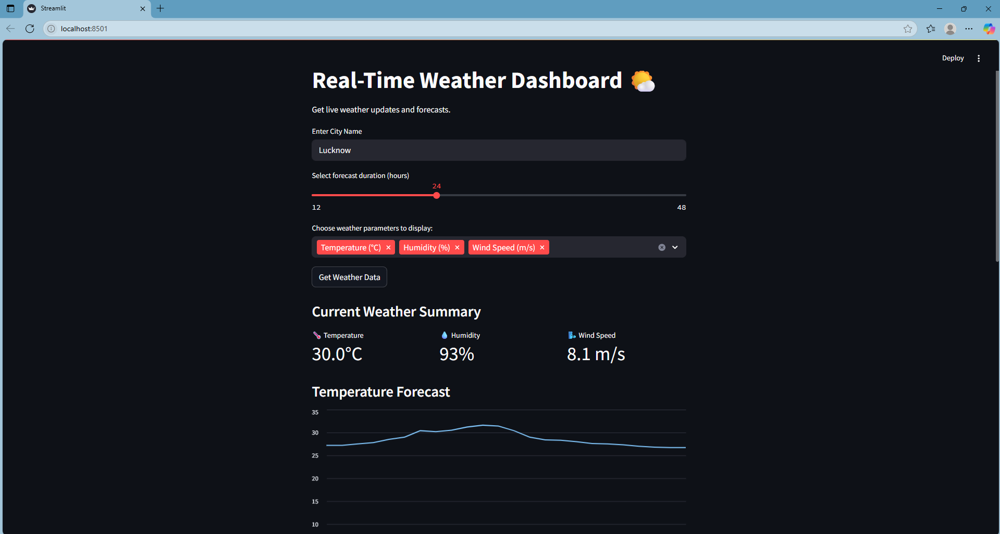

# 🌤️ Real-Time Weather Dashboard

Get live weather updates and 48-hour forecasts with dynamic charts and a clean Streamlit UI.



---

## 📌 Features

- 🌍 Search any city worldwide
- ⏳ Select forecast duration (12–48 hours)
- 🌡️ View temperature, humidity, and wind speed
- 📈 Interactive line charts
- ⚙️ User-selected weather parameters

---

## 🛠 Tech Stack

- **Streamlit** – UI and charts  
- **Open-Meteo API** – weather and geocoding  
- **Pandas** – data manipulation  
- **Requests** – API calls  

---

## 🚀 Try It Live

▶️ [Launch Streamlit App](https://ammarabidi-streamlit-weather-dashboard-weather-dashboard-y8ivwq.streamlit.app/)

---

## 📦 Installation

```bash
git clone https://github.com/ammarabidi/streamlit-weather-dashboard.git
cd streamlit-weather-dashboard
pip install -r requirements.txt
streamlit run weather_dashboard.py
